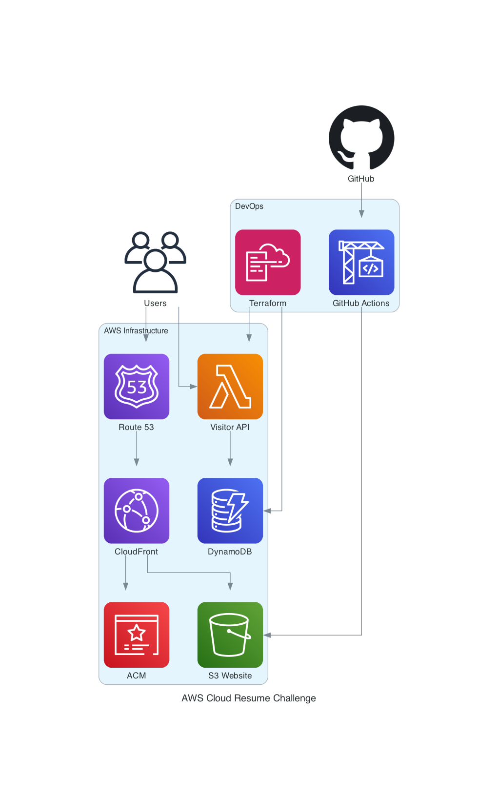

# AWS Cloud Resume Challenge


This is Sagar Utekar's implementation of the AWS Cloud Resume Challenge.
What is Cloud Resume Challenge? - [The Cloud Resume Challenge](https://cloudresumechallenge.dev/) is a multiple-step resume project which helps build and demonstrate skills fundamental to pursuing a career in Cloud. The project was published by Forrest Brazeal.

## Architecture



The architecture follows a serverless approach using AWS services:

1. **Frontend**: Static website hosted on S3 with CloudFront CDN
2. **Backend**: Lambda function for visitor counter API
3. **Database**: DynamoDB for storing view counts
4. **Security**: Certificate Manager for SSL/TLS certificates
5. **DNS**: Route 53 for domain resolution
6. **CI/CD**: GitHub Actions for automated deployment
7. **Infrastructure**: Terraform for Infrastructure as Code

**Services Used**:

- S3
- AWS CloudFront
- Certificate Manager
- AWS Lambda
- Dynamo DB
- GitHub Actions
- Terraform

## Project Structure

```
├── website/           # Frontend files (HTML, CSS, JS)
├── infra/            # Terraform infrastructure code
│   ├── main.tf       # Main Terraform configuration
│   ├── provider.tf   # AWS provider configuration
│   └── lambda/       # Lambda function code
├── .github/workflows/ # GitHub Actions CI/CD
└── generated-diagrams/ # Architecture diagrams
```

## AWS Services Overview

- **S3**: Static website hosting for HTML/CSS/JS files
- **CloudFront**: Global CDN for fast content delivery and caching
- **Route 53**: DNS service for domain name resolution
- **Certificate Manager**: SSL/TLS certificates for HTTPS encryption
- **Lambda**: Serverless function to handle visitor counter API
- **DynamoDB**: NoSQL database to store visitor count data
- **IAM**: Identity and access management for secure permissions

## Prerequisites

### Required Tools & Accounts

#### 1. AWS Account
- **Purpose**: Host your serverless resume infrastructure
- **Setup**: [Create AWS Account](https://aws.amazon.com/free/)
- **Permissions**: IAM user with Lambda, DynamoDB, S3, CloudFront access

#### 2. AWS CLI
- **Purpose**: Command-line interface for AWS services
- **Install**: 
  ```bash
  # macOS
  brew install awscli
  # Windows
  winget install Amazon.AWSCLI
  # Linux
  curl "https://awscli.amazonaws.com/awscli-exe-linux-x86_64.zip" -o "awscliv2.zip"
  ```
- **Configure**: `aws configure` (enter Access Key, Secret Key, Region)

#### 3. Terraform
- **Purpose**: Infrastructure as Code tool for AWS resource management
- **Install**:
  ```bash
  # macOS
  brew install terraform
  # Windows
  winget install Hashicorp.Terraform
  # Linux
  wget https://releases.hashicorp.com/terraform/1.6.0/terraform_1.6.0_linux_amd64.zip
  ```
- **Verify**: `terraform --version`

#### 4. Python 3.8+
- **Purpose**: Local development server and Lambda runtime
- **Install**: [Python Downloads](https://www.python.org/downloads/)
- **Verify**: `python3 --version`

#### 5. Docker
- **Purpose**: Containerized local testing environment
- **Install**: [Docker Desktop](https://www.docker.com/products/docker-desktop/)
- **Verify**: `docker --version`

#### 6. Git
- **Purpose**: Version control and repository management
- **Install**: [Git Downloads](https://git-scm.com/downloads)
- **Verify**: `git --version`

### Optional Development Tools

#### 7. Amazon Q Developer
- **What is it**: AI-powered coding assistant built by AWS for developers
- **Purpose**: Provides intelligent code suggestions, AWS best practices, and debugging help
- **Features**:
  - Code completion and generation
  - AWS service recommendations
  - Security vulnerability detection
  - Code explanations and documentation
- **Setup**:
  1. Install VS Code extension: Search "Amazon Q" in VS Code Extensions
  2. Sign in with AWS Builder ID (free) or AWS IAM Identity Center
  3. Enable in VS Code settings
- **Usage**: Type code and get AI suggestions, ask questions in chat panel

#### 8. uvx (Universal eXecutable)
- **What is it**: Tool to run Python applications in isolated environments
- **Purpose**: Execute Python packages without installing them globally
- **Install**: `pip install uvx`
- **Usage**: `uvx package-name` runs packages in temporary environments
- **Benefits**: No dependency conflicts, clean system

#### 9. MCP (Model Context Protocol)
- **What is it**: Open protocol for connecting AI assistants to external tools and data
- **Purpose**: Enables AI models to interact with various services and APIs
- **How it works**: AI assistants use MCP servers to access external functionality
- **Benefits**: Extends AI capabilities beyond text generation

#### 10. Diagram MCP Server
- **What is it**: MCP server that generates AWS architecture diagrams
- **Purpose**: Create visual diagrams programmatically using AI
- **Setup**:
  1. Create `.vscode/mcp.json` in your project root:
     ```json
     {
       "mcpServers": {
         "awslabs.core-mcp-server": {
           "command": "uvx",
           "args": ["awslabs.core-mcp-server@latest"],
           "env": {
             "FASTMCP_LOG_LEVEL": "ERROR"
           }
         }
       }
     }
     ```
  2. Restart VS Code to load MCP server
  3. Use Amazon Q Developer to generate diagrams
- **Usage**: Ask Amazon Q to "create AWS architecture diagram" and it will use the MCP server

### Setup Verification
```bash
# Verify all tools are installed
aws --version
terraform --version
python3 --version
docker --version
git --version

# Test AWS connectivity
aws sts get-caller-identity
```

## Step-by-Step Setup

### 1. Clone Repository
```bash
git clone https://github.com/sagar2366/cloud-resume-challenge.git
cd cloud-resume-challenge/cloud-resume-challenge
```

### 2. Configure AWS Credentials
```bash
aws configure
# Enter your AWS Access Key ID, Secret Access Key, and region
```

### 3. Deploy Infrastructure

#### Option A: Using Terraform (Recommended)
```bash
cd infra
terraform init
terraform plan
terraform apply -auto-approve
```

#### Option B: Manual AWS Console Setup
If not using Terraform, create resources manually:

1. **Create DynamoDB Table**:
   - Go to DynamoDB Console
   - Create table named `resume-challenge`
   - Partition key: `id` (String)
   - Use on-demand billing
   - Add item: `id: "0"`, `views: 0`

2. **Create Lambda Function**:
   - Go to Lambda Console
   - Create function: `myfunc`
   - Runtime: Python 3.8
   - Upload `infra/lambda/func.py` code
   - Create function URL with CORS enabled
   - Set environment variables if needed

3. **Configure IAM Role**:
   - Create role for Lambda
   - Attach policies:
     - `AWSLambdaBasicExecutionRole`
     - Custom policy for DynamoDB access:
       ```json
       {
         "Version": "2012-10-17",
         "Statement": [
           {
             "Effect": "Allow",
             "Action": [
               "dynamodb:GetItem",
               "dynamodb:UpdateItem"
             ],
             "Resource": "arn:aws:dynamodb:*:*:table/resume-challenge"
           }
         ]
       }
       ```

4. **Create S3 Bucket** (for website hosting):
   - Go to S3 Console
   - Create bucket with unique name
   - Enable static website hosting
   - Set index document: `index.html`
   - Configure bucket policy for public read access

5. **Setup CloudFront** (optional):
   - Create CloudFront distribution
   - Origin: S3 bucket
   - Configure caching and SSL

### 4. Note Lambda Function URL
After deployment, copy the Lambda function URL from:
- Terraform output, OR
- Lambda Console → Function → Configuration → Function URL

### 5. Update Website JavaScript
Update `website/index.js` with your Lambda function URL:
```javascript
const API_URL = 'your-lambda-function-url-here';
```

### 6. Deploy Website
**Option A: Manual Upload**
```bash
aws s3 sync website/ s3://your-bucket-name --delete
```

**Option B: GitHub Actions (Recommended)**
- Push changes to main branch
- GitHub Actions automatically deploys to S3

### 7. Configure Domain (Optional)
- Update Route 53 hosted zone
- Point domain to CloudFront distribution
- Update Certificate Manager for custom domain

### 8. Test the Application
- Visit your website URL
- Verify visitor counter increments
- Check Lambda logs in CloudWatch

## Docker Deployment (Local Testing)

### Build and Run with Docker
```bash
# Build the Docker image
docker build -t cloud-resume-challenge .

# Run the container
docker run -d -p 8080:80 --name resume-site cloud-resume-challenge

# Access the website at http://localhost:8080
```

### Docker Commands
```bash
# Stop the container
docker stop resume-site

# Remove the container
docker rm resume-site

# Remove the image
docker rmi cloud-resume-challenge
```

### Docker Compose (Optional)
Create `docker-compose.yml`:
```yaml
version: '3.8'
services:
  website:
    build: .
    ports:
      - "8080:80"
    container_name: resume-site
```

Run with:
```bash
docker-compose up -d
docker-compose down
```

## Cleanup
```bash
cd infra
terraform destroy -auto-approve
```


## [Live Demo 🔗](https://sagarutekar.com)

## YouTube Video

🎥 [AWS Cloud Resume Challenge - Complete Tutorial](https://youtu.be/YOUR_VIDEO_ID)

A comprehensive walkthrough covering:
- Setting up S3 and CloudFront
- Creating Lambda function and DynamoDB
- Implementing visitor counter with JavaScript
- CI/CD with GitHub Actions
- Infrastructure as Code with Terraform

 
## Author
**Sagar Utekar**
- GitHub: [sagar2366](https://github.com/sagar2366)
- LinkedIn: [sagar-utekar](https://linkedin.com/in/sagar-utekar)
  
## Stars
[](https://starchart.cc/sagar2366/cloud-resume-challenge)
