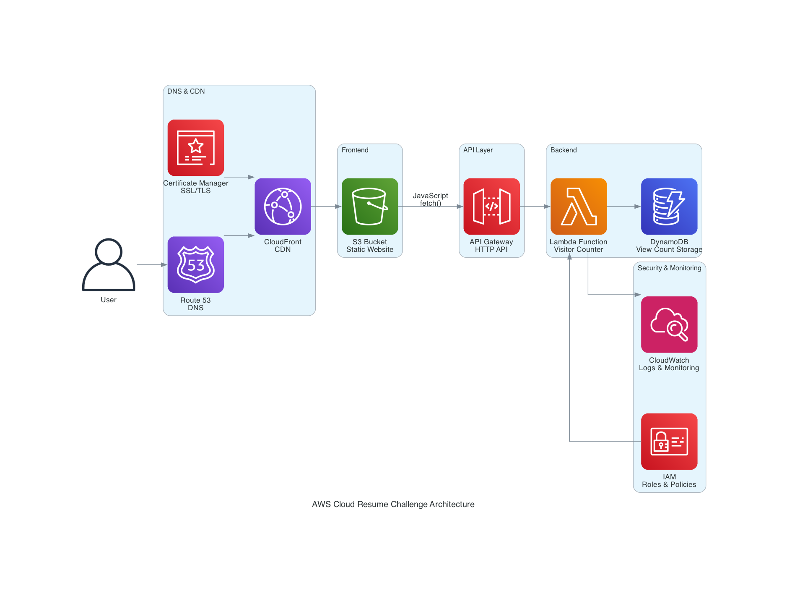

# AWS Cloud Resume Challenge


This is Sagar Utekar's implementation of the AWS Cloud Resume Challenge.
What is Cloud Resume Challenge? - [The Cloud Resume Challenge](https://cloudresumechallenge.dev/) is a multiple-step resume project which helps build and demonstrate skills fundamental to pursuing a career in Cloud. The project was published by Forrest Brazeal.

## Architecture



The architecture follows a serverless approach using AWS services:

1. **Frontend**: Static website hosted on S3 with CloudFront CDN
2. **API Layer**: API Gateway HTTP API for visitor counter endpoint
3. **Backend**: Lambda function for visitor counter logic
4. **Database**: DynamoDB for storing view counts
5. **Security**: Certificate Manager for SSL/TLS certificates
6. **DNS**: Route 53 for domain resolution

**Services Used**:

- **S3**: Static website hosting
- **CloudFront**: Global CDN with HTTPS enforcement
- **API Gateway**: HTTP API for visitor counter endpoint
- **Lambda**: Serverless function for counter logic
- **DynamoDB**: NoSQL database for view count storage
- **Certificate Manager**: SSL/TLS certificates
- **Route 53**: DNS management
- **IAM**: Security roles and policies
- **CloudWatch**: Logging and monitoring


## Project Structure

```
├── website/           # Frontend files (HTML, CSS, JS)
├── infra/            # Infrastructure code
│   └── lambda/       # Lambda function code
└── generated-diagrams/ # Architecture diagrams
```

## Prerequisites

### Required Tools & Accounts

#### 1. AWS Account
- **Purpose**: Host your serverless resume infrastructure
- **Setup**: [Create AWS Account](https://aws.amazon.com/free/)
- **Permissions**: IAM user with Lambda, DynamoDB, S3, CloudFront access

#### 2. AWS CLI (Optional for Part 1)
- **Purpose**: Command-line interface for AWS services
- **Install**: 
  ```bash
  # macOS
  brew install awscli
  # Windows
  winget install Amazon.AWSCLI
  # Linux
  curl "https://awscli.amazonaws.com/awscli-exe-linux-x86_64.zip" -o "awscliv2.zip"
  ```
- **Configure**: `aws configure` (enter Access Key, Secret Key, Region)


#### 3. Amazon Q Developer
- **What is it**: AI-powered coding assistant built by AWS for developers
- **Purpose**: Provides intelligent code suggestions, AWS best practices, and debugging help
- **Features**:
  - Code completion and generation
  - AWS service recommendations
  - Security vulnerability detection
  - Code explanations and documentation
- **Setup**:
  1. Install VS Code extension: Search "Amazon Q" in VS Code Extensions
  2. Sign in with AWS Builder ID (free) or AWS IAM Identity Center
  3. Enable in VS Code settings
- **Usage**: Type code and get AI suggestions, ask questions in chat panel

#### 4. uvx (Universal eXecutable)
- **What is it**: Tool to run Python applications in isolated environments
- **Purpose**: Execute Python packages without installing them globally
- **Install**: `pip install uvx`
- **Usage**: `uvx package-name` runs packages in temporary environments
- **Benefits**: No dependency conflicts, clean system

#### 5. MCP (Model Context Protocol)


- **What is it**: Open protocol for connecting AI assistants to external tools and data
- **Purpose**: Enables AI models to interact with various services and APIs
- **How it works**: AI assistants use MCP servers to access external functionality
- **Benefits**: Extends AI capabilities beyond text generation

#### 6. Diagram MCP Server
- **What is it**: MCP server that generates AWS architecture diagrams
- **Purpose**: Create visual diagrams programmatically using AI
- **Setup**:
  1. Create `.vscode/mcp.json` in your project root:
     ```json
     {
       "mcpServers": {
         "awslabs.core-mcp-server": {
           "command": "uvx",
           "args": ["awslabs.core-mcp-server@latest"],
           "env": {
             "FASTMCP_LOG_LEVEL": "ERROR"
           }
         }
       }
     }
     ```
  2. Restart VS Code to load MCP server
  3. Use Amazon Q Developer to generate diagrams
- **Usage**: Ask Amazon Q to "create AWS architecture diagram" and it will use the MCP server

### Setup Verification
```bash
# Test AWS connectivity (if AWS CLI installed)
aws sts get-caller-identity
```

## Part 1: Manual Setup (Learning Approach)

This section walks through creating everything manually via AWS Console to understand each component. Each step is done through point-and-click interface to learn how AWS services work together.

### Prerequisites Check
```bash
# Verify tools are installed
aws --version
# Test AWS connectivity
aws sts get-caller-identity
```

### 1. Clone Repository
```bash
git clone https://github.com/sagar2366/cloud-resume-challenge.git
cd cloud-resume-challenge/cloud-resume-challenge
```

### 2. Manual AWS Console Setup
Create all resources step-by-step through AWS Console:

1. **Create DynamoDB Table**:
   - Go to DynamoDB Console
   - Create table named `cloud-resume-table`
   - Partition key: `id` (String)
   - Use on-demand billing
   - Add initial item: `id: "0"`, `views: 0`

2. **Create Lambda Function**:
   - Go to Lambda Console
   - Create function: `cloud-resume-lambda`
   - Runtime: Python 3.12
   - Upload `infra/lambda/func.py` code
   - Handler: `func.lambda_handler`
   - Timeout: 30 seconds

3. **Configure IAM Role for Lambda** (**Security**: Least privilege principle):
   - Create role: `cloud-resume-lambda-role`
   - Trust policy: Allow Lambda service to assume role
   - Attach policies:
     - `AWSLambdaBasicExecutionRole`
     - Custom DynamoDB policy (minimal permissions):
       ```json
       {
         "Version": "2012-10-17",
         "Statement": [
           {
             "Effect": "Allow",
             "Action": [
               "dynamodb:GetItem",
               "dynamodb:UpdateItem"
             ],
             "Resource": "arn:aws:dynamodb:*:*:table/cloud-resume-table"
           }
         ]
       }
       ```
   - **Security Features**: Only specific table access, no admin permissions, resource-specific ARN

4. **Create API Gateway (HTTP API)** (**Security**: Built-in DDoS protection):
   - Go to API Gateway Console
   - Create HTTP API
   - Name: `cloud-resume-challenge`
   - Create route: `GET /visitor` (only GET method for security)
   - Integration type: Lambda function
   - Lambda function: `cloud-resume-lambda`
   - Deploy to `$default` stage
   - Note the API endpoint URL
   - **Security Features**: Rate limiting (10K req/sec), CORS control, method restrictions

5. **Configure Lambda Permissions for API Gateway**:
   
   *Console Method:*
   - Go to Lambda Console → Functions → cloud-resume-lambda
   - Click "Configuration" → "Permissions"
   - Under "Resource-based policy", click "Add permissions"
   - Service: API Gateway
   - Source ARN: `arn:aws:execute-api:REGION:ACCOUNT:API-ID/*/*/visitor`
   - Click "Save"
   
   *CLI Method:*
   ```bash
   aws lambda add-permission \
     --function-name cloud-resume-lambda \
     --statement-id apigateway-invoke \
     --action lambda:InvokeFunction \
     --principal apigateway.amazonaws.com \
     --source-arn "arn:aws:execute-api:REGION:ACCOUNT:API-ID/*/*/visitor"
   ```

6. **Create S3 Bucket** (**Security**: Read-only public access):
   
   *Console Method:*
   - Go to S3 Console → "Create bucket"
   - Bucket name: `your-unique-bucket-name`
   - Region: us-east-1 (or your preferred region)
   - Uncheck "Block all public access" (required for website hosting)
   - Click "Create bucket"
   - Click on bucket → "Properties" → "Static website hosting"
   - Enable static website hosting
   - Index document: `index.html`
   - Click "Save"
   - Go to "Permissions" → "Bucket policy"
   - Add policy (read-only for security):
     ```json
     {
       "Version": "2012-10-17",
       "Statement": [
         {
           "Sid": "PublicReadGetObject",
           "Effect": "Allow",
           "Principal": "*",
           "Action": "s3:GetObject",
           "Resource": "arn:aws:s3:::your-bucket-name/*"
         }
       ]
     }
     ```
   - **Security Features**: Only `GetObject` permission, no write/delete access, static content only
   
   *CLI Method:*
   ```bash
   # Create bucket
   aws s3 mb s3://your-unique-bucket-name
   
   # Enable static website hosting
   aws s3 website s3://your-bucket-name --index-document index.html
   
   # Set bucket policy
   aws s3api put-bucket-policy --bucket your-bucket-name --policy file://bucket-policy.json
   ```

7. **Setup CloudFront** (**Security**: HTTPS enforcement + DDoS protection):
   
   *Console Method:*
   - Go to CloudFront Console → "Create distribution"
   - Origin domain: Select your S3 bucket
   - Origin access: "Origin access control settings (recommended)" (security best practice)
   - Create new OAC if needed
   - Default cache behavior: Allow GET, HEAD methods only
   - Viewer protocol policy: "Redirect HTTP to HTTPS" (enforces encryption)
   - Price class: "Use all edge locations"
   - Default root object: `index.html`
   - Click "Create distribution"
   - Update S3 bucket policy to allow CloudFront access
   - **Security Features**: HTTPS enforcement, Origin Access Control, DDoS protection, geographic restrictions available
   
   *CLI Method:*
   ```bash
   # Create distribution (requires JSON config file)
   aws cloudfront create-distribution --distribution-config file://cloudfront-config.json
   ```

### 3. Note API Gateway URL
After manual setup, copy the API Gateway URL from:
- API Gateway Console → Your API → Stages → $default

### 4. Update Website JavaScript
Update `website/index.js` with your API Gateway URL:
```javascript
// Replace with your API Gateway URL
fetch("https://your-api-id.execute-api.region.amazonaws.com/visitor")
```

### 5. Deploy Website Manually
```bash
aws s3 sync website/ s3://your-bucket-name --delete
```

### 6. Configure Custom Domain (Optional)

#### Option A: Using GoDaddy Domain with Route 53

**Step 1: Purchase Domain from GoDaddy**
- Go to [GoDaddy.com](https://godaddy.com)
- Search and purchase your domain (e.g., `yourname.com`)
- Complete the purchase process

**Step 2: Create Route 53 Hosted Zone**

*AWS Console Method:*
- Go to Route 53 Console → Hosted zones
- Click "Create hosted zone"
- Domain name: `yourname.com`
- Type: Public hosted zone
- Click "Create hosted zone"
- Note the 4 name servers (NS records)

*CLI Method:*
```bash
# Create hosted zone for your domain
aws route53 create-hosted-zone --name yourname.com --caller-reference $(date +%s)
```

**Step 3: Get Route 53 Name Servers**

*AWS Console Method:*
- In Route 53 Console → Hosted zones
- Click on your domain
- Copy the 4 NS record values (name servers)

*CLI Method:*
```bash
# Get the name servers for your hosted zone
aws route53 list-hosted-zones-by-name --dns-name yourname.com
aws route53 get-hosted-zone --id /hostedzone/YOUR_ZONE_ID
```

**Step 4: Update GoDaddy Name Servers**
- Log into your GoDaddy account
- Go to "My Products" → "DNS"
- Click "Change" next to Nameservers
- Select "Custom" nameservers
- Enter the 4 Route 53 name servers:
  ```
  ns-xxx.awsdns-xx.com
  ns-xxx.awsdns-xx.co.uk
  ns-xxx.awsdns-xx.net
  ns-xxx.awsdns-xx.org
  ```
- Save changes (propagation takes 24-48 hours)

**Step 5: Request SSL Certificate** (**Security**: Free SSL with auto-renewal)

*AWS Console Method:*
- Go to Certificate Manager Console (us-east-1 region)
- Click "Request a certificate"
- Select "Request a public certificate"
- Domain names: `yourname.com` and `www.yourname.com`
- Validation method: DNS validation (more secure than email)
- Key algorithm: RSA 2048 (strong encryption)
- Click "Request"
- **Security Features**: TLS 1.2+ enforced, auto-renewal, AWS-managed certificates

*CLI Method:*
```bash
# Request certificate for your domain
aws acm request-certificate \
  --domain-name yourname.com \
  --subject-alternative-names www.yourname.com \
  --validation-method DNS \
  --region us-east-1
```

**Step 6: Validate Certificate**

*AWS Console Method:*
- In Certificate Manager Console
- Click on your certificate
- Click "Create records in Route 53" for DNS validation
- Click "Create records"
- Wait for certificate status to become "Issued" (5-10 minutes)

*CLI Method:*
```bash
# Get certificate validation records
aws acm describe-certificate --certificate-arn YOUR_CERT_ARN --region us-east-1
```

**Step 7: Update CloudFront Distribution**

*AWS Console Method:*
- Go to CloudFront Console
- Click on your distribution ID
- Click "Edit"
- Under "Settings":
  - Alternate domain names (CNAMEs): Add `yourname.com` and `www.yourname.com`
  - Custom SSL certificate: Select your certificate from dropdown
- Click "Save changes"
- Wait for deployment (Status: "Deployed")

*CLI Method:*
```bash
# Get current distribution config
aws cloudfront get-distribution-config --id YOUR_DISTRIBUTION_ID > dist-config.json

# Edit the config file to add domain names and certificate
# Then update the distribution
aws cloudfront update-distribution --id YOUR_DISTRIBUTION_ID --distribution-config file://updated-config.json --if-match ETAG_VALUE
```

**Step 8: Create Route 53 Records**

*AWS Console Method:*

**For Root Domain (yourname.com):**
- Go to Route 53 Console → Hosted zones
- Click on your domain
- Click "Create record"
- Record name: Leave blank (root domain)
- Record type: A
- Toggle "Alias" to ON
- Route traffic to: "Alias to CloudFront distribution"
- Choose distribution: Select your CloudFront distribution
- Click "Create records"

**For WWW Subdomain:**
- Click "Create record"
- Record name: `www`
- Record type: CNAME
- Value: `yourname.com`
- TTL: 300
- Click "Create records"

*CLI Method:*
```bash
# Create A record for root domain
aws route53 change-resource-record-sets --hosted-zone-id YOUR_ZONE_ID --change-batch '{
  "Changes": [{
    "Action": "CREATE",
    "ResourceRecordSet": {
      "Name": "yourname.com",
      "Type": "A",
      "AliasTarget": {
        "DNSName": "your-cloudfront-domain.cloudfront.net",
        "EvaluateTargetHealth": false,
        "HostedZoneId": "Z2FDTNDATAQYW2"
      }
    }
  }]
}'

# Create CNAME record for www subdomain
aws route53 change-resource-record-sets --hosted-zone-id YOUR_ZONE_ID --change-batch '{
  "Changes": [{
    "Action": "CREATE",
    "ResourceRecordSet": {
      "Name": "www.yourname.com",
      "Type": "CNAME",
      "TTL": 300,
      "ResourceRecords": [{"Value": "yourname.com"}]
    }
  }]
}'
```

#### Option B: Using Route 53 Domain Registration

**Step 1: Register Domain with Route 53**

*AWS Console Method:*
- Go to Route 53 Console → Registered domains
- Click "Register domain"
- Search for your domain name
- Select domain and click "Add to cart"
- Fill in contact information
- Review and complete purchase
- Domain registration takes 24-48 hours

*CLI Method:*
```bash
# Check domain availability
aws route53domains check-domain-availability --domain-name yourname.com

# Register domain (if available)
aws route53domains register-domain \
  --domain-name yourname.com \
  --duration-in-years 1 \
  --admin-contact file://contact.json \
  --registrant-contact file://contact.json \
  --tech-contact file://contact.json
```

**Step 2: Domain automatically creates hosted zone**
- Route 53 automatically creates hosted zone
- Name servers are automatically configured
- Continue from Step 5 above (SSL Certificate)

#### Domain Verification Commands
```bash
# Check DNS propagation
nslookup yourname.com
dig yourname.com

# Test SSL certificate
curl -I https://yourname.com

# Verify CloudFront distribution
aws cloudfront list-distributions --query 'DistributionList.Items[?contains(Aliases.Items, `yourname.com`)].{Id:Id,DomainName:DomainName}'
```

### 7. Test the Manual Setup
- Visit your website URL
- Verify visitor counter increments
- Check Lambda logs in CloudWatch

---

## Part 2: Automated Setup (Production Approach)


This section shows how to automate everything using Terraform and GitHub Actions for a production-ready setup.

### Prerequisites for Automation
```bash
# Verify all automation tools
aws --version
terraform --version
git --version
```

### 1. Infrastructure as Code with Terraform

#### Deploy Infrastructure Automatically
```bash
cd infra
terraform init
terraform plan
terraform apply -auto-approve
```

#### Get Terraform Outputs
```bash
# Get API Gateway URL
terraform output api_gateway_url
terraform output visitor_api_url
```

### 2. Update Website with Terraform Output
Update `website/index.js` with the Terraform output URL:
```javascript
// Use the visitor_api_url from terraform output
fetch("TERRAFORM_OUTPUT_URL_HERE")
```

### 3. Setup GitHub Actions CI/CD

#### Configure GitHub Secrets
Add these secrets to your GitHub repository:
- `AWS_ACCESS_KEY_ID`
- `AWS_SECRET_ACCESS_KEY`
- `AWS_REGION`

#### Automated Deployment
- Push changes to main branch
- GitHub Actions automatically:
  - Deploys website to S3
  - Runs Terraform for infrastructure changes
  - Invalidates CloudFront cache

### 4. Test the Automated Setup
- Visit your website URL
- Verify visitor counter increments
- Check GitHub Actions workflow logs
- Monitor CloudWatch logs

### 5. Docker for Local Development (Optional)

Test your website locally before deploying:

### Build and Run with Docker
```bash
# Build the Docker image
docker build -t cloud-resume-challenge .

# Run the container
docker run -d -p 8080:80 --name resume-site cloud-resume-challenge

# Access the website at http://localhost:8080
```

### Docker Commands
```bash
# Stop the container
docker stop resume-site

# Remove the container
docker rm resume-site

# Remove the image
docker rmi cloud-resume-challenge
```

### Docker Compose (Optional)
Create `docker-compose.yml`:
```yaml
version: '3.8'
services:
  website:
    build: .
    ports:
      - "8080:80"
    container_name: resume-site
```

Run with:
```bash
docker-compose up -d
docker-compose down
```

### 6. Comparison: Manual vs Automated

| Aspect | Manual Setup (Part 1) | Automated Setup (Part 2) |
|--------|----------------------|-------------------------|
| **Learning** | ✅ Understand each component | ⚠️ Abstracted complexity |
| **Time** | ⏱️ 2-3 hours | ⚡ 15-30 minutes |
| **Reproducibility** | ❌ Manual steps, prone to errors | ✅ Consistent, repeatable |
| **Production Ready** | ⚠️ Manual updates required | ✅ CI/CD pipeline |
| **Cost** | 💰 Same AWS costs | 💰 Same AWS costs |
| **Maintenance** | 🔧 Manual updates | 🤖 Automated updates |
| **Best For** | Learning, understanding AWS | Production, team collaboration |

**Recommendation**: 
- **Start with Part 1** to understand AWS services
- **Move to Part 2** for production deployments

---

## Troubleshooting (Both Approaches)

### Common Issues

#### 1. Visitor Counter Shows Zero
**Symptoms**: Counter always displays "Views: 0"

**Possible Causes & Solutions**:
- **DynamoDB Reserved Keyword**: The word "views" is reserved in DynamoDB
  - **Fix**: Use `ExpressionAttributeNames` in Lambda code:
    ```python
    UpdateExpression='SET #v = if_not_exists(#v, :start) + :incr',
    ExpressionAttributeNames={'#v': 'views'}
    ```

- **Wrong Table Name**: Lambda function looking for wrong table
  - **Fix**: Ensure Lambda uses correct table name (`cloud-resume-table`)

- **JSON Serialization Error**: DynamoDB returns Decimal type
  - **Fix**: Convert to int in Lambda: `views = int(response['Attributes']['views'])`

- **API Gateway Permissions**: Lambda lacks invoke permissions
  - **Console Fix**: 
    - Go to Lambda Console → Functions → cloud-resume-lambda
    - Click "Configuration" → "Permissions"
    - Under "Resource-based policy", click "Add permissions"
    - Service: API Gateway
    - Source ARN: `arn:aws:execute-api:REGION:ACCOUNT:API-ID/*/*/visitor`
    - Click "Save"
  - **CLI Fix**:
    ```bash
    aws lambda add-permission --function-name cloud-resume-lambda \
      --statement-id apigateway-invoke --action lambda:InvokeFunction \
      --principal apigateway.amazonaws.com \
      --source-arn "arn:aws:execute-api:REGION:ACCOUNT:API-ID/*/*/visitor"
    ```

#### 2. API Gateway Returns "Not Found"
**Symptoms**: API returns `{"message":"Not Found"}`

**Console Solutions**:
- Go to API Gateway Console → Your API
- Check Routes: Ensure `GET /visitor` route exists
- Check Integration: Click route → verify Lambda function is selected
- Check Stage: Go to "Deploy" → ensure deployed to `$default` stage
- Redeploy: Click "Deploy" → select `$default` stage → "Deploy"

**CLI Solutions**:
```bash
# Check routes
aws apigatewayv2 get-routes --api-id YOUR_API_ID

# Check integration
aws apigatewayv2 get-integration --api-id YOUR_API_ID --integration-id INTEGRATION_ID

# Redeploy stage
aws apigatewayv2 create-deployment --api-id YOUR_API_ID --stage-name '$default'
```

#### 3. CORS Errors in Browser
**Symptoms**: Browser console shows CORS policy errors

**Console Solutions**:
- Go to API Gateway Console → Your API
- Click "CORS" in left sidebar
- Configure CORS settings:
  - Access-Control-Allow-Origin: `*`
  - Access-Control-Allow-Headers: `content-type,x-amz-date,authorization,x-api-key`
  - Access-Control-Allow-Methods: `GET,POST,OPTIONS`
- Click "Save"
- Deploy the API

**Lambda Code Fix**:
```python
'headers': {
    'Access-Control-Allow-Origin': '*',
    'Access-Control-Allow-Headers': 'Content-Type',
    'Access-Control-Allow-Methods': 'GET, POST, OPTIONS'
}
```

#### 4. Lambda Function Timeout
**Symptoms**: Function times out after 3 seconds

**Console Solutions**:
- Go to Lambda Console → Functions → cloud-resume-lambda
- Click "Configuration" → "General configuration" → "Edit"
- Set Timeout: 30 seconds
- Click "Save"
- Check DynamoDB: Go to DynamoDB Console → Tables → verify `cloud-resume-table` exists
- Check IAM: Go to IAM Console → Roles → Lambda role → verify DynamoDB permissions

**CLI Solutions**:
```bash
# Update timeout
aws lambda update-function-configuration --function-name cloud-resume-lambda --timeout 30

# Check DynamoDB table
aws dynamodb describe-table --table-name cloud-resume-table
```

#### 5. CloudFront Caching Issues
**Symptoms**: Website shows old content after updates

**Solutions**:
- **Console Method - Invalidate CloudFront Cache**:
  - Go to CloudFront Console
  - Click on your distribution
  - Go to "Invalidations" tab
  - Click "Create invalidation"
  - Object paths: `/index.js` or `/*` (for everything)
  - Click "Create invalidation"
  - Wait for status to become "Completed"

- **CLI Method - Invalidate CloudFront Cache**:
  ```bash
  # Find your distribution ID
  aws cloudfront list-distributions --query 'DistributionList.Items[].{Id:Id,DomainName:DomainName}'
  
  # Invalidate specific files
  aws cloudfront create-invalidation --distribution-id YOUR_DISTRIBUTION_ID --paths "/index.js" "/index.html"
  
  # Invalidate everything (costs more)
  aws cloudfront create-invalidation --distribution-id YOUR_DISTRIBUTION_ID --paths "/*"
  
  # Check invalidation status
  aws cloudfront get-invalidation --distribution-id YOUR_DISTRIBUTION_ID --id YOUR_INVALIDATION_ID
  ```

- **Console Method - Set Cache Headers in S3**:
  - Go to S3 Console → Your bucket
  - Select file (e.g., index.js)
  - Click "Actions" → "Edit metadata"
  - Add metadata:
    - Key: `Cache-Control`
    - Value: `no-cache` (for dynamic files) or `max-age=31536000` (for static files)
  - Click "Save changes"

- **CLI Method - Set Cache Headers in S3**:
  ```bash
  # Upload with no-cache for dynamic files
  aws s3 cp website/index.js s3://your-bucket/index.js --cache-control "no-cache"
  
  # Upload with long cache for static assets
  aws s3 cp website/style.css s3://your-bucket/style.css --cache-control "max-age=31536000"
  ```

### Debug Commands
```bash
# Test Lambda function directly
aws lambda invoke --function-name cloud-resume-lambda --payload '{}' response.json
cat response.json

# Check CloudWatch logs (security: audit trail)
aws logs describe-log-groups --log-group-name-prefix "/aws/lambda/cloud-resume-lambda"
aws logs describe-log-streams --log-group-name "/aws/lambda/cloud-resume-lambda" --order-by LastEventTime --descending --max-items 1

# Test API Gateway endpoint
curl -X GET "https://your-api-id.execute-api.region.amazonaws.com/visitor"

# Check DynamoDB table (security: verify data integrity)
aws dynamodb scan --table-name cloud-resume-table
aws dynamodb get-item --table-name cloud-resume-table --key '{"id":{"S":"0"}}'

# Test website endpoints (security: verify HTTPS)
curl -I https://your-domain.com  # Should show HTTPS redirect
curl -s https://your-domain.com/index.js | grep -A 5 "fetch.*visitor"

# Security validation commands
curl -X POST https://your-api-id.execute-api.region.amazonaws.com/visitor  # Should return method not allowed
curl -I http://your-domain.com  # Should redirect to HTTPS

# Check CloudFront distribution
aws cloudfront list-distributions --query 'DistributionList.Items[].{Id:Id,Status:Status,DomainName:DomainName}'

# Verify DNS resolution
nslookup your-domain.com
dig your-domain.com

# Verify IAM permissions (security check)
aws iam simulate-principal-policy --policy-source-arn YOUR_LAMBDA_ROLE_ARN --action-names dynamodb:DeleteTable --resource-arns YOUR_TABLE_ARN
```

### Security Summary
This architecture implements multiple security layers:
- **API Security**: Rate limiting, CORS control, method restrictions
- **Lambda Security**: Least privilege IAM, no user input, error handling
- **Data Security**: DynamoDB encryption, IAM-only access, minimal permissions
- **Infrastructure Security**: HTTPS enforcement, read-only S3, Origin Access Control
- **Monitoring**: CloudWatch logs, error tracking, audit trails
- **Known Limitations**: Public API by design, no authentication (acceptable for visitor counter)


## Cleanup

### Manual Setup Cleanup
- Delete resources manually through AWS Console in reverse order:
  1. CloudFront distribution
  2. S3 bucket contents and bucket
  3. API Gateway
  4. Lambda function
  5. DynamoDB table
  6. IAM roles
  7. Route 53 hosted zone (if created)

### Automated Setup Cleanup
```bash
cd infra
terraform destroy -auto-approve
```


## [Live Demo](https://sagarutekar.com)

## YouTube Video

[AWS Cloud Resume Challenge - Complete Tutorial](https://youtu.be/YOUR_VIDEO_ID)

A comprehensive walkthrough covering:
- Setting up S3 and CloudFront
- Creating Lambda function and DynamoDB
- Implementing visitor counter with JavaScript
- CI/CD with GitHub Actions
- Infrastructure as Code with Terraform

 
## Author
**Sagar Utekar**
- GitHub: [sagar2366](https://github.com/sagar2366)
- LinkedIn: [sagar-utekar](https://linkedin.com/in/sagar-utekar)
  
## Stars
[](https://starchart.cc/sagar2366/cloud-resume-challenge)
